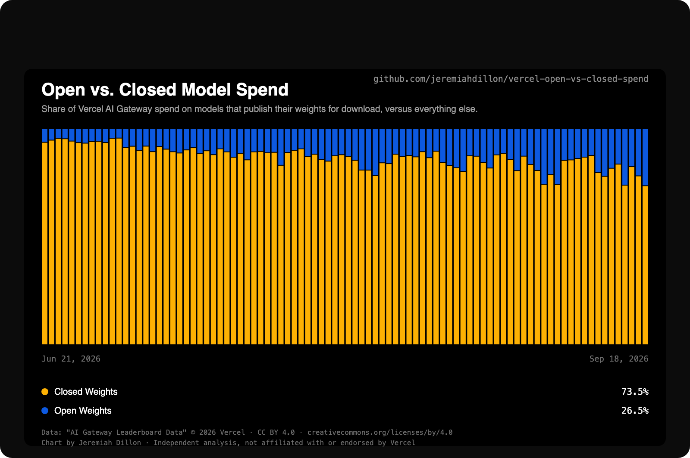
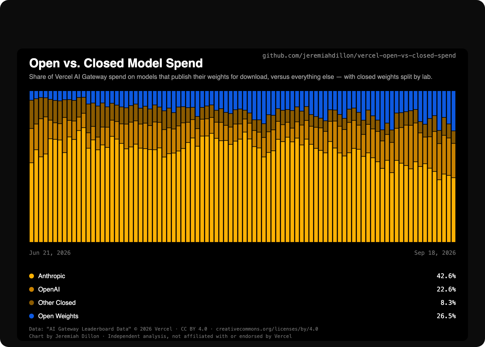

# Vercel AI Gateway: open vs. closed model **spend**

The inverse of a widely-shared chart about **token volume** — same data, same window,
same styling, denominated in **dollars** instead.

Everything here is reproducible from committed data with **no API key** and **no
third-party Python dependencies** (Python 3.8+, standard library only). Charts are
emitted as hand-written **SVG**.

> **Snapshot as of 2026-09-19.** These charts show a fixed 90-day window
> (Jun 21 – Sep 18, 2026). The underlying shares move daily and September is moving
> fast — see [Freshness](#freshness) before citing any number here as current.

## Origin

On 2026-09-18, Vercel CEO Guillermo Rauch [posted](https://x.com/rauchg/status/2101186741042663579)
that open-weight models had hit a record **78.4%** of token volume on Vercel AI
Gateway, noting in passing that "spend usually tells a different story."

This repo tells that story. It is the same chart, for the same 90 days, measuring
spend.

| Sep 18, 2026 | Open weights | Closed weights |
|---|---|---|
| Token volume (original chart) | 78.4% | 21.6% |
| **Spend (Chart 1)** | **26.5%** | **73.5%** |

Open weights take roughly three-quarters of the tokens and roughly a quarter of the
dollars. Chart 2 splits the closed side to show where those dollars land.

## Charts

| Chart | File (`charts/`) | Series |
|---|---|---|
| 1 | `1-open-vs-closed-spend.svg` | Open vs. closed |
| 2 | `2-open-vs-closed-spend-by-lab.svg` | Anthropic, OpenAI, Other Closed, Open |

(`.png` versions accompany each `.svg`.)

### Chart 1 — open vs. closed



### Chart 2 — closed split by lab



Stack order bottom→top: Anthropic, OpenAI, Other Closed, Open Weights.

| | Sep 18, 2026 | Window mean |
|---|---|---|
| Anthropic | 42.6% | 61.0% |
| Open weights | 26.5% | 13.2% |
| OpenAI | 22.6% | 15.5% |
| Other closed | 8.3% | 10.3% |

The two charts are deliberately identical except where the extra granularity demands
otherwise: same title, same subhead sentence plus one clause, same bottom→top legend
order, same window and geometry.

## Reproduce

```bash
# Build everything from the committed snapshot — no key, no network.
make all              # == charts + png
# or:
python3 scripts/build_chart.py
python3 scripts/build_chart_labs.py
bash scripts/render_png.sh

# Optional: re-pull the snapshot from Vercel's public endpoint.
make fetch
```

Running against the committed snapshot regenerates both **SVGs byte-for-byte**.

**PNGs are not byte-reproducible.** They come out of headless Chrome, whose raster
output varies across versions and platforms. SVG is the primary artifact; the PNGs
are a convenience render. Any rasterizer works — `rsvg-convert`, `cairosvg`, or
Chrome; see the header of `scripts/render_png.sh`.

## Data source

Vercel publishes the leaderboard data openly, with no authentication:

```
GET https://vercel.com/api/ai/leaderboard-export
    ?dataset=labs&modality=all&from=2025-10-01&to=2026-09-19
```

| Parameter | Values |
|---|---|
| `dataset` | `models`, `labs`, `apps`, `providers` |
| `modality` | `all`, `text`, `image`, `video` (models/labs only) |
| `format` | `json`, `csv` |
| `from` / `to` | `YYYY-MM-DD`; earliest is **2025-10-01**, default is a rolling 2-month window |

Each row is one lab's share of one metric (`requests`, `tokens`, `spend`) on one day.

**Vercel publishes percentage share only — never absolute volumes.** There is no
token count, no dollar figure, and no denominator anywhere in the dataset. Every
number in this repo is therefore a share of gateway activity, and nothing here can be
converted into revenue, market size, or any company's actual income.

## Freshness

The window is pinned in `scripts/window.py` so the committed charts stay reproducible.
That file documents how to widen it; the committed snapshot already runs
2025-10-01 → 2026-09-19, so extending *backwards* needs no re-fetch.

Worth knowing before you cite the window mean: **September broke the pattern.**
Anthropic fell 14.6 points month-over-month (63.5% in August → 48.9% Sep 1–18), with
OpenAI up 9.3, Moonshot up 3.7 and DeepSeek up 2.9 over the same span. The 42.6% on
the final bar is the low point of a steady 18-day slide, not a typical day. The 61.0%
window mean describes Jun–Sep as a whole and already understates how fast the recent
trend is moving.

## Method & caveats

**Classification is lab-level, not model-level.** The `labs` dataset has no per-model
license field, so each lab is assigned wholesale to open or closed (the set is in
`scripts/window.py`). This is imperfect: Alibaba publishes most Qwen weights but
Qwen-Max is proprietary; OpenAI has gpt-oss; Google has Gemma. The `models` dataset
carries model names but only ~11 per day plus a ~20% `Other` bucket, so it cannot
support a full-history model-level split.

**Consequence: these charts will not match Vercel's own to the decimal.** The same
code run on *tokens* gives 81.5% open for Sep 18 against the original chart's 78.4% —
a ~3-point gap from classification, not from the data.

**Calibration.** This classification reproduces Vercel's own published August figures:
56.6% / 14.9% here versus "56% of token volume, 14% of spend" in the
[September Production Index](https://vercel.com/blog/ai-gateway-production-index-september-2026).
Anthropic's spend share also matches Vercel's two published claims — 63.5% here vs.
their stated "64% of all spend" for August, and a 61.3% monthly floor since December
vs. their stated "minimum 61 cents per dollar since December."

**Spend is not lab revenue.** As Rauch noted, this is spend on inference across
providers, most of which accrues to the serving layer (Fireworks, Baseten, and
others), not to the labs that published the weights. DeepSeek is the notable
exception — it ranks #1 on Vercel's providers leaderboard, serving its own models.

**One gateway, not the market.** Vercel AI Gateway's heaviest users are coding agents,
where Claude is dominant and tokens are long-context and cache-heavy. That is a
specific population, and these shares describe it rather than AI usage at large.

**Daily shares sum to exactly 100** across all 30 labs on all 354 days, so the
normalization in the build scripts is a no-op and does not inflate any series.

## Palette

Blue `#0D59E0` and base yellow `#FDB103` are sampled pixel-exact from the original
chart image; `#C98200` and `#8A5A00` extend that hue into a ramp for the lab split.

Validated against the black plot surface: worst adjacent pair ΔE 15.1 normal-vision /
12.4 tritan, with chroma floor and 3:1 contrast passing on all four steps. `#FDB103`
sits above the usual dark-mode lightness band — kept deliberately, for fidelity to the
original. Three yellows on black is near the practical limit of a single-hue ramp; a
finer lab split would need a second hue rather than more steps.

## License

Code: [MIT](LICENSE).

Data under `data/raw/` is "AI Gateway Leaderboard Data," © 2026 Vercel, licensed under
[CC BY 4.0](https://creativecommons.org/licenses/by/4.0/) and redistributed here under
those terms. That notice is also carried on the face of each chart, scoped to the data —
the charts themselves are not Vercel's work.

The charts deliberately mirror the styling of the original for comparability. This is an
independent analysis: **not affiliated with, sponsored by, or endorsed by Vercel.**
